# Parking Lot System - Detailed Class Diagram

## Complete Class Diagram

```mermaid
classDiagram
    %% Enums
    class VehicleType {
        <<enumeration>>
        SMALL
        MEDIUM
        LARGE
        +getDisplayName() String
        +toString() String
    }

    %% Core Entities
    class Vehicle {
        -int vehicleId
        -VehicleType type
        -String licensePlate
        -String ownerName
        +Vehicle(int, VehicleType, String, String)
        +Vehicle(int, VehicleType, String)
        +getVehicleId() int
        +getType() VehicleType
        +getLicensePlate() String
        +getOwnerName() String
        +equals(Object) boolean
        +hashCode() int
        +toString() String
    }

    class ParkingSpot {
        -int parkingSpotId
        -VehicleType compatibleVehicleType
        -Vehicle parkedVehicle
        -LocalDateTime parkingStartTime
        +ParkingSpot(int, VehicleType)
        +getParkingSpotId() int
        +getCompatibleVehicleType() VehicleType
        +isAvailable() boolean
        +canParkVehicle(Vehicle) boolean
        +parkVehicle(Vehicle) boolean
        +vacateSpot() Vehicle
        +getParkedVehicle() Vehicle
        +getParkingStartTime() LocalDateTime
        +getParkingDurationInHours() long
        +equals(Object) boolean
        +hashCode() int
        +toString() String
    }

    class Ticket {
        -String ticketId
        -Vehicle vehicle
        -LocalDateTime entryTime
        -LocalDateTime exitTime
        -int parkingSpotId
        -double baseFare
        -double hourlyRate
        +Ticket(String, Vehicle, int, double, double)
        +getTicketId() String
        +getVehicle() Vehicle
        +getEntryTime() LocalDateTime
        +getExitTime() LocalDateTime
        +setExitTime(LocalDateTime) void
        +getParkingSpotId() int
        +getBaseFare() double
        +getHourlyRate() double
        +isActive() boolean
        +getParkingDurationInHours() long
        +calculateFare() double
        +equals(Object) boolean
        +hashCode() int
        +toString() String
    }

    %% Management Classes
    class FareCalculator {
        -Map~VehicleType, Double~ baseFareMapping
        -Map~VehicleType, Double~ hourlyFareMapping
        +FareCalculator()
        +FareCalculator(Map, Map)
        -initializeDefaultFares() void
        +setBaseFare(VehicleType, double) void
        +setHourlyRate(VehicleType, double) void
        +getBaseFare(VehicleType) double
        +getHourlyRate(VehicleType) double
        +calculateFare(Ticket) double
        +calculateFare(VehicleType, long) double
        +getBaseFareMapping() Map
        +getHourlyFareMapping() Map
        +toString() String
    }

    class ParkingManager {
        -Map~VehicleType, List~ParkingSpot~~ availableSpots
        -Map~Vehicle, ParkingSpot~ vehicleSpotMapping
        -Map~String, Ticket~ activeTickets
        -FareCalculator fareCalculator
        -int ticketCounter
        +ParkingManager(FareCalculator)
        +addParkingSpot(ParkingSpot) void
        +addParkingSpots(List~ParkingSpot~) void
        +parkVehicle(Vehicle) Ticket
        +unparkVehicle(String) double
        +unparkVehicle(Vehicle) double
        +isVehicleParked(Vehicle) boolean
        +getVehicleSpot(Vehicle) ParkingSpot
        +getAvailableSpots(VehicleType) List~ParkingSpot~
        +getAllAvailableSpots() List~ParkingSpot~
        +getAvailableSpotCount(VehicleType) int
        +getTotalAvailableSpotCount() int
        +getAvailableSpotCountByType() Map~VehicleType, Integer~
        +getActiveTickets() List~Ticket~
        +getTicket(String) Ticket
        -findAvailableSpot(Vehicle) ParkingSpot
        -moveToFront(Node) void
        -addToFront(Node) void
        -removeNode(Node) void
        -removeLRU() void
        -removeFromAvailableSpots(ParkingSpot) void
        -addToAvailableSpots(ParkingSpot) void
        -findActiveTicketForVehicle(Vehicle) Ticket
        -generateTicketId() String
        +toString() String
    }

    class ParkingLot {
        -ParkingManager manager
        -FareCalculator calculator
        -String parkingLotId
        -String location
        +ParkingLot(String, String)
        +ParkingLot(String, String, FareCalculator)
        +getParkingLotId() String
        +getLocation() String
        +getCalculator() FareCalculator
        +getManager() ParkingManager
        +parkVehicle(Vehicle) Ticket
        +unparkVehicle(Ticket) double
        +unparkVehicle(String) double
        +unparkVehicle(Vehicle) double
        +isVehicleParked(Vehicle) boolean
        +getVehicleSpot(Vehicle) ParkingSpot
        +getVehicleTicket(Vehicle) Ticket
        +getTicket(String) Ticket
        +getActiveTickets() List~Ticket~
        +getAvailableSpots(VehicleType) List~ParkingSpot~
        +getAllAvailableSpots() List~ParkingSpot~
        +getAvailableSpotCount(VehicleType) int
        +getTotalAvailableSpotCount() int
        +getAvailableSpotCountByType() Map~VehicleType, Integer~
        +addParkingSpots(List~ParkingSpot~) void
        +addParkingSpot(ParkingSpot) void
        +calculateFare(Ticket) double
        +calculateFare(VehicleType, long) double
        +getStatus() String
        +toString() String
    }

    %% Relationships
    Vehicle --> VehicleType : has type
    ParkingSpot --> VehicleType : compatible with
    ParkingSpot --> Vehicle : can park
    Ticket --> Vehicle : belongs to
    Ticket --> ParkingSpot : assigned to
    ParkingManager --> FareCalculator : uses
    ParkingManager --> ParkingSpot : manages
    ParkingManager --> Vehicle : tracks
    ParkingManager --> Ticket : creates
    ParkingLot --> ParkingManager : orchestrates
    ParkingLot --> FareCalculator : uses
```



## Class Relationships

### 1. Vehicle and VehicleType
- **Vehicle** has a **VehicleType** (enum)
- One-to-one relationship
- Vehicle type determines parking spot compatibility

### 2. ParkingSpot and Vehicle
- **ParkingSpot** can accommodate a **Vehicle**
- One-to-one relationship when parked
- ParkingSpot tracks the parked vehicle and parking start time

### 3. Ticket and Vehicle
- **Ticket** belongs to a **Vehicle**
- One-to-one relationship
- Ticket tracks the vehicle's parking session

### 4. Ticket and ParkingSpot
- **Ticket** is assigned to a **ParkingSpot**
- One-to-one relationship
- Ticket contains the parking spot ID

### 5. ParkingManager and Components
- **ParkingManager** manages all **ParkingSpot** objects
- **ParkingManager** tracks all **Vehicle** to **ParkingSpot** mappings
- **ParkingManager** creates and manages **Ticket** objects
- **ParkingManager** uses **FareCalculator** for fare calculations

### 6. ParkingLot and Components
- **ParkingLot** orchestrates **ParkingManager** and **FareCalculator**
- **ParkingLot** provides the main API for parking operations
- **ParkingLot** acts as a facade for the entire system

## Design Principles Applied

### 1. Single Responsibility Principle (SRP)
- Each class has a single, well-defined responsibility
- **Vehicle**: Represents a vehicle entity
- **ParkingSpot**: Manages parking spot state
- **Ticket**: Tracks parking session
- **FareCalculator**: Handles fare calculations
- **ParkingManager**: Manages parking operations
- **ParkingLot**: Provides system interface

### 2. Open/Closed Principle (OCP)
- **FareCalculator** can be extended with new fare strategies
- **VehicleType** can be extended with new vehicle types
- **ParkingSpot** can be extended with new spot types

### 3. Dependency Inversion Principle (DIP)
- **ParkingLot** depends on abstractions (ParkingManager, FareCalculator)
- **ParkingManager** depends on FareCalculator abstraction
- Easy to swap implementations (e.g., different fare calculators)

### 4. Encapsulation
- All fields are private with public getters
- Internal state management is hidden
- Business logic is encapsulated within appropriate classes

## Key Design Decisions

### 1. Immutable Objects
- **Vehicle** objects are immutable after creation
- **VehicleType** enum is immutable
- Ensures thread safety and prevents state corruption

### 2. Mutable State Management
- **ParkingSpot** manages mutable state (parked vehicle, start time)
- **Ticket** manages mutable state (exit time)
- **ParkingManager** manages mutable mappings

### 3. Separation of Concerns
- **FareCalculator** is separate from parking logic
- **ParkingManager** handles spot allocation
- **ParkingLot** provides high-level API

### 4. Error Handling
- Each class validates its inputs
- Appropriate exceptions are thrown for invalid operations
- Clear error messages for debugging

## Extensibility Points

### 1. New Vehicle Types
```java
public enum VehicleType {
    SMALL, MEDIUM, LARGE, EXTRA_LARGE, MOTORCYCLE
}
```

### 2. New Fare Strategies
```java
public interface FareStrategy {
    double calculateFare(Ticket ticket);
}

public class PremiumFareStrategy implements FareStrategy {
    // Premium fare calculation
}
```

### 3. New Parking Spot Types
```java
public class DisabledParkingSpot extends ParkingSpot {
    // Special handling for disabled parking
}
```

### 4. New Ticket Types
```java
public class ReservationTicket extends Ticket {
    // Special handling for reserved parking
}
```

This class diagram provides a complete view of the parking lot system's architecture, showing all relationships, responsibilities, and extensibility points. 