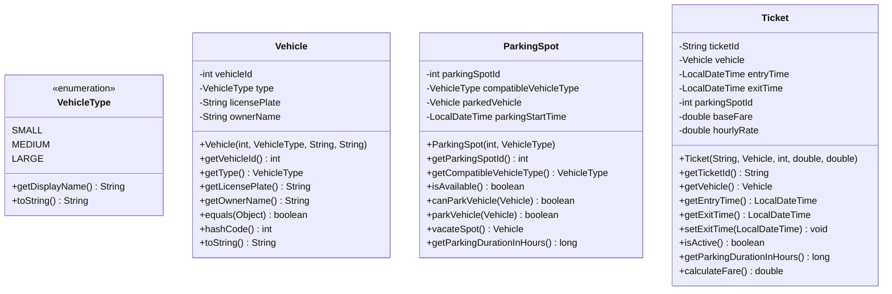
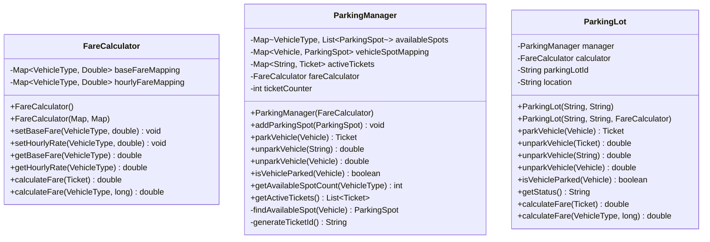
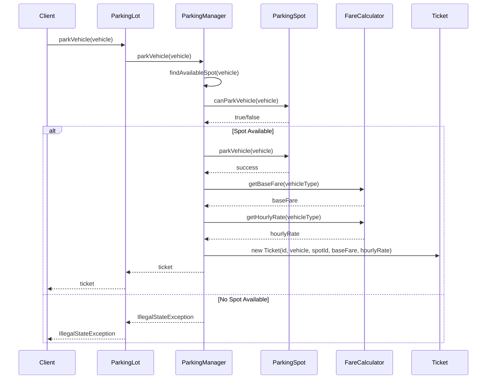
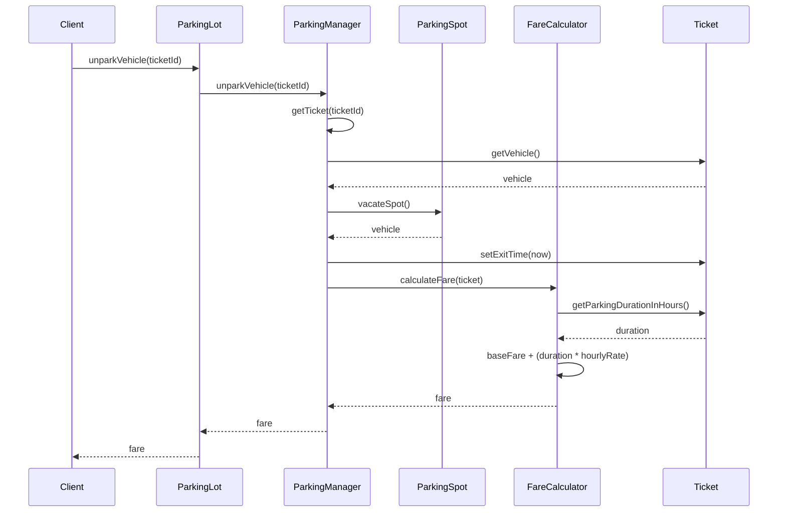

# Parking Lot System - Low Level Design

## Table of Contents
1. [System Overview](#system-overview)
2. [Class Diagrams](#class-diagrams)
3. [Sequence Diagrams](#sequence-diagrams)
4. [Database Schema](#database-schema)
5. [API Design](#api-design)
6. [Design Patterns](#design-patterns)
7. [Error Handling](#error-handling)
8. [Scalability Considerations](#scalability-considerations)
9. [Testing Strategy](#testing-strategy)
10. [Performance Analysis](#performance-analysis)

---

## System Overview

### Problem Statement
Design a parking lot system that can handle different types of vehicles, manage parking spots, calculate fares, and provide real-time status updates.

### Functional Requirements
- Park vehicles of different types (Small, Medium, Large)
- Unpark vehicles and calculate fare based on duration
- Check parking spot availability
- Generate parking tickets
- Handle different fare structures for different vehicle types
- Provide real-time parking lot status

### Non-Functional Requirements
- **Scalability**: Support multiple parking lots
- **Performance**: O(1) time complexity for parking/unparking operations
- **Reliability**: Handle concurrent access
- **Extensibility**: Easy to add new vehicle types or fare structures

---

## Class Diagrams

### Core Entity Classes



### Management Classes



---

## Sequence Diagrams

### Vehicle Parking Flow



### Vehicle Unparking Flow



---

## Database Schema

### Tables Design

```sql
-- Vehicle Types Table
CREATE TABLE vehicle_types (
    id INT PRIMARY KEY,
    name VARCHAR(20) NOT NULL,
    display_name VARCHAR(50) NOT NULL,
    created_at TIMESTAMP DEFAULT CURRENT_TIMESTAMP
);

-- Vehicles Table
CREATE TABLE vehicles (
    id INT PRIMARY KEY,
    vehicle_type_id INT NOT NULL,
    license_plate VARCHAR(20) UNIQUE NOT NULL,
    owner_name VARCHAR(100) NOT NULL,
    created_at TIMESTAMP DEFAULT CURRENT_TIMESTAMP,
    FOREIGN KEY (vehicle_type_id) REFERENCES vehicle_types(id)
);

-- Parking Spots Table
CREATE TABLE parking_spots (
    id INT PRIMARY KEY,
    parking_lot_id INT NOT NULL,
    spot_number VARCHAR(10) NOT NULL,
    vehicle_type_id INT NOT NULL,
    is_available BOOLEAN DEFAULT TRUE,
    created_at TIMESTAMP DEFAULT CURRENT_TIMESTAMP,
    FOREIGN KEY (vehicle_type_id) REFERENCES vehicle_types(id)
);

-- Parking Tickets Table
CREATE TABLE parking_tickets (
    id VARCHAR(20) PRIMARY KEY,
    vehicle_id INT NOT NULL,
    parking_spot_id INT NOT NULL,
    entry_time TIMESTAMP NOT NULL,
    exit_time TIMESTAMP NULL,
    base_fare DECIMAL(10,2) NOT NULL,
    hourly_rate DECIMAL(10,2) NOT NULL,
    total_fare DECIMAL(10,2) NULL,
    status ENUM('ACTIVE', 'COMPLETED', 'CANCELLED') DEFAULT 'ACTIVE',
    created_at TIMESTAMP DEFAULT CURRENT_TIMESTAMP,
    FOREIGN KEY (vehicle_id) REFERENCES vehicles(id),
    FOREIGN KEY (parking_spot_id) REFERENCES parking_spots(id)
);

-- Fare Configuration Table
CREATE TABLE fare_configurations (
    id INT PRIMARY KEY,
    vehicle_type_id INT NOT NULL,
    base_fare DECIMAL(10,2) NOT NULL,
    hourly_rate DECIMAL(10,2) NOT NULL,
    effective_from TIMESTAMP NOT NULL,
    effective_to TIMESTAMP NULL,
    created_at TIMESTAMP DEFAULT CURRENT_TIMESTAMP,
    FOREIGN KEY (vehicle_type_id) REFERENCES vehicle_types(id)
);

-- Parking Lots Table
CREATE TABLE parking_lots (
    id INT PRIMARY KEY,
    name VARCHAR(100) NOT NULL,
    location VARCHAR(200) NOT NULL,
    total_spots INT NOT NULL,
    created_at TIMESTAMP DEFAULT CURRENT_TIMESTAMP
);
```

### Indexes for Performance

```sql
-- Indexes for better query performance
CREATE INDEX idx_vehicles_license_plate ON vehicles(license_plate);
CREATE INDEX idx_parking_spots_availability ON parking_spots(is_available, vehicle_type_id);
CREATE INDEX idx_parking_tickets_status ON parking_tickets(status);
CREATE INDEX idx_parking_tickets_vehicle ON parking_tickets(vehicle_id);
CREATE INDEX idx_parking_tickets_entry_time ON parking_tickets(entry_time);
CREATE INDEX idx_fare_config_effective ON fare_configurations(effective_from, effective_to);
```

---

## API Design

### REST API Endpoints

```java
// Parking Operations
POST /api/v1/parking-lots/{lotId}/park
{
    "vehicleId": 123,
    "licensePlate": "ABC123",
    "vehicleType": "SMALL",
    "ownerName": "John Doe"
}
Response: {
    "ticketId": "TICKET-000001",
    "parkingSpotId": 1,
    "entryTime": "2024-01-15T10:30:00Z",
    "estimatedFare": 15.0
}

POST /api/v1/parking-lots/{lotId}/unpark
{
    "ticketId": "TICKET-000001"
}
Response: {
    "ticketId": "TICKET-000001",
    "exitTime": "2024-01-15T12:30:00Z",
    "totalFare": 25.0,
    "durationHours": 2
}

// Query Operations
GET /api/v1/parking-lots/{lotId}/status
Response: {
    "lotId": "PL001",
    "totalSpots": 100,
    "availableSpots": {
        "SMALL": 20,
        "MEDIUM": 15,
        "LARGE": 10
    },
    "occupiedSpots": 55,
    "activeTickets": 55
}

GET /api/v1/parking-lots/{lotId}/spots/available
Response: {
    "spots": [
        {
            "spotId": 1,
            "vehicleType": "SMALL",
            "isAvailable": true
        }
    ]
}

GET /api/v1/parking-lots/{lotId}/tickets/{ticketId}
Response: {
    "ticketId": "TICKET-000001",
    "vehicle": {
        "id": 123,
        "licensePlate": "ABC123",
        "type": "SMALL"
    },
    "parkingSpotId": 1,
    "entryTime": "2024-01-15T10:30:00Z",
    "currentFare": 15.0,
    "status": "ACTIVE"
}
```

---

## Design Patterns

### 1. Strategy Pattern (Fare Calculation)
```java
public interface FareCalculationStrategy {
    double calculateFare(Ticket ticket);
}

public class StandardFareStrategy implements FareCalculationStrategy {
    @Override
    public double calculateFare(Ticket ticket) {
        // Standard calculation logic
    }
}

public class PremiumFareStrategy implements FareCalculationStrategy {
    @Override
    public double calculateFare(Ticket ticket) {
        // Premium calculation logic
    }
}
```

### 2. Factory Pattern (Vehicle Creation)
```java
public class VehicleFactory {
    public static Vehicle createVehicle(VehicleType type, String licensePlate, String ownerName) {
        return new Vehicle(generateId(), type, licensePlate, ownerName);
    }
    
    private static int generateId() {
        // ID generation logic
    }
}
```

### 3. Observer Pattern (Parking Lot Events)
```java
public interface ParkingLotObserver {
    void onVehicleParked(Vehicle vehicle, ParkingSpot spot);
    void onVehicleUnparked(Vehicle vehicle, double fare);
    void onParkingLotFull();
}

public class ParkingLotSubject {
    private List<ParkingLotObserver> observers = new ArrayList<>();
    
    public void addObserver(ParkingLotObserver observer) {
        observers.add(observer);
    }
    
    public void notifyVehicleParked(Vehicle vehicle, ParkingSpot spot) {
        observers.forEach(observer -> observer.onVehicleParked(vehicle, spot));
    }
}
```

### 4. Singleton Pattern (Configuration)
```java
public class ParkingLotConfig {
    private static ParkingLotConfig instance;
    private final Map<String, Object> config = new HashMap<>();
    
    private ParkingLotConfig() {}
    
    public static ParkingLotConfig getInstance() {
        if (instance == null) {
            instance = new ParkingLotConfig();
        }
        return instance;
    }
    
    public void setConfig(String key, Object value) {
        config.put(key, value);
    }
    
    public Object getConfig(String key) {
        return config.get(key);
    }
}
```

---

## Error Handling

### Exception Hierarchy
```java
public abstract class ParkingLotException extends RuntimeException {
    private final String errorCode;
    
    public ParkingLotException(String message, String errorCode) {
        super(message);
        this.errorCode = errorCode;
    }
}

public class ParkingLotFullException extends ParkingLotException {
    public ParkingLotFullException(String message) {
        super(message, "PARKING_LOT_FULL");
    }
}

public class VehicleAlreadyParkedException extends ParkingLotException {
    public VehicleAlreadyParkedException(String message) {
        super(message, "VEHICLE_ALREADY_PARKED");
    }
}

public class InvalidTicketException extends ParkingLotException {
    public InvalidTicketException(String message) {
        super(message, "INVALID_TICKET");
    }
}
```

### Error Response Format
```json
{
    "error": {
        "code": "PARKING_LOT_FULL",
        "message": "No available parking spot for vehicle type: SMALL",
        "timestamp": "2024-01-15T10:30:00Z",
        "details": {
            "requestedVehicleType": "SMALL",
            "availableSpots": {
                "SMALL": 0,
                "MEDIUM": 5,
                "LARGE": 10
            }
        }
    }
}
```

---

## Scalability Considerations

### 1. Horizontal Scaling
- **Multiple Parking Lots**: Each parking lot can be deployed as a separate service
- **Load Balancing**: Use API Gateway to distribute requests across multiple instances
- **Database Sharding**: Shard by parking lot ID or geographic region

### 2. Caching Strategy
```java
@Service
public class ParkingSpotCacheService {
    private final Cache<String, ParkingSpot> spotCache;
    private final Cache<String, List<ParkingSpot>> availableSpotsCache;
    
    public ParkingSpot getSpot(String spotId) {
        return spotCache.get(spotId, () -> loadFromDatabase(spotId));
    }
    
    public List<ParkingSpot> getAvailableSpots(VehicleType type) {
        String cacheKey = "available_" + type.name();
        return availableSpotsCache.get(cacheKey, () -> loadAvailableSpotsFromDB(type));
    }
}
```

### 3. Asynchronous Processing
```java
@Component
public class ParkingEventProcessor {
    @Async
    public void processParkingEvent(ParkingEvent event) {
        // Process parking events asynchronously
        // Update analytics, send notifications, etc.
    }
}
```

### 4. Microservices Architecture
```
┌─────────────────┐    ┌─────────────────┐    ┌─────────────────┐
│   API Gateway   │    │  Parking Lot    │    │   Payment       │
│                 │    │   Service       │    │   Service       │
└─────────────────┘    └─────────────────┘    └─────────────────┘
         │                       │                       │
         │                       │                       │
         ▼                       ▼                       ▼
┌─────────────────┐    ┌─────────────────┐    ┌─────────────────┐
│   Notification  │    │   Analytics     │    │   User          │
│   Service       │    │   Service       │    │   Service       │
└─────────────────┘    └─────────────────┘    └─────────────────┘
```

---

## Testing Strategy

### 1. Unit Tests
- **Entity Tests**: Test all entity classes (Vehicle, ParkingSpot, Ticket)
- **Service Tests**: Test business logic in ParkingManager and FareCalculator
- **Exception Tests**: Test all error scenarios

### 2. Integration Tests
```java
@SpringBootTest
@TestPropertySource(locations = "classpath:application-test.properties")
class ParkingLotIntegrationTest {
    
    @Autowired
    private ParkingLotService parkingLotService;
    
    @Test
    void testCompleteParkingFlow() {
        // Test complete parking and unparking flow
    }
}
```

### 3. Performance Tests
```java
@Test
void testConcurrentParking() {
    int numberOfThreads = 100;
    CountDownLatch latch = new CountDownLatch(numberOfThreads);
    
    for (int i = 0; i < numberOfThreads; i++) {
        new Thread(() -> {
            try {
                Vehicle vehicle = createTestVehicle();
                Ticket ticket = parkingLot.parkVehicle(vehicle);
                assertNotNull(ticket);
            } finally {
                latch.countDown();
            }
        }).start();
    }
    
    latch.await(30, TimeUnit.SECONDS);
}
```

---

## Performance Analysis

### Time Complexity
- **Parking**: O(1) - Direct HashMap lookup for available spots
- **Unparking**: O(1) - Direct HashMap lookup for vehicle-spot mapping
- **Fare Calculation**: O(1) - Simple arithmetic operations
- **Status Query**: O(n) - Where n is number of spots (can be optimized with caching)

### Space Complexity
- **Parking Spots**: O(n) - Where n is total number of parking spots
- **Vehicle Mapping**: O(m) - Where m is number of parked vehicles
- **Active Tickets**: O(m) - Where m is number of active tickets

### Memory Usage Estimation
```
For a parking lot with 1000 spots:
- ParkingSpot objects: ~1000 * 200 bytes = 200KB
- Vehicle mappings: ~500 * 100 bytes = 50KB (assuming 50% occupancy)
- Active tickets: ~500 * 300 bytes = 150KB
- Total estimated memory: ~400KB
```

### Optimization Strategies
1. **Lazy Loading**: Load parking spots on demand
2. **Connection Pooling**: Use database connection pools
3. **Caching**: Cache frequently accessed data
4. **Indexing**: Proper database indexing for queries
5. **Batch Operations**: Process multiple operations in batches

---

## Deployment Architecture

### Containerization
```dockerfile
FROM openjdk:21-jdk-slim
COPY target/parking-lot-system.jar app.jar
EXPOSE 8080
ENTRYPOINT ["java", "-jar", "/app.jar"]
```

### Kubernetes Deployment
```yaml
apiVersion: apps/v1
kind: Deployment
metadata:
  name: parking-lot-service
spec:
  replicas: 3
  selector:
    matchLabels:
      app: parking-lot-service
  template:
    metadata:
      labels:
        app: parking-lot-service
    spec:
      containers:
      - name: parking-lot-service
        image: parking-lot-system:latest
        ports:
        - containerPort: 8080
        env:
        - name: DB_URL
          valueFrom:
            secretKeyRef:
              name: db-secret
              key: url
```

### Monitoring and Logging
```java
@Component
public class ParkingLotMetrics {
    private final MeterRegistry meterRegistry;
    
    public void recordParkingEvent(VehicleType vehicleType) {
        meterRegistry.counter("parking.events", "vehicle.type", vehicleType.name()).increment();
    }
    
    public void recordFareCalculation(double fare) {
        meterRegistry.timer("fare.calculation").record(Duration.ofMillis(System.currentTimeMillis()));
    }
}
```

---

This Low Level Design provides a comprehensive blueprint for implementing a scalable, maintainable, and robust parking lot system. The design covers all aspects from data modeling to deployment strategies, ensuring the system can handle real-world requirements effectively. 